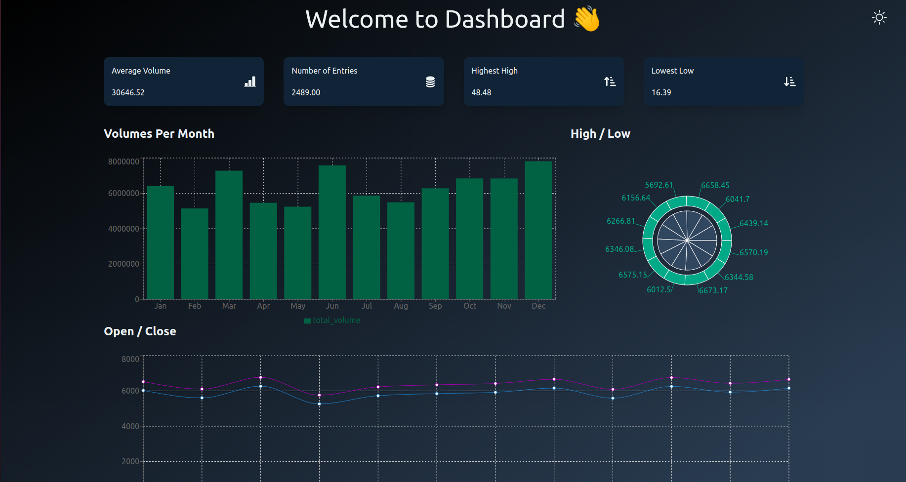

# Stock Market Data Analysis and Real Time Anomaly Detection Pipeline

## Overview
This project implements a big data pipeline focused on stock market data analysis and real-time anomaly detection. The pipeline is composed of several Spark jobs that perform data ingestion, analysis, model training, and real-time prediction. The system uses Docker to orchestrate various services including Apache Spark, Cassandra, Kafka, Zookeeper, MongoDB, and HDFS. \
**Demo :**
[](https://youtu.be/ojuW3IhrSLo)
## Architecture


## Setup
The services are initiated via a Docker Compose file. Additional setup for Cassandra and MongoDB is required.

### Cassandra Setup
Create the necessary keyspace and table by executing the initialization script:
```shell
docker exec cassandra /home/init-cassandra.sh
```

### MongoDB Setup
Configure a replication set for MongoDB:
```shell
docker exec -it mongo bash
mongo
rs.initiate({
   _id: 'myReplicaSet',
   members: [
     { _id: 0, host: 'mongo:27017' }
   ]
});
```

## Data Ingestion Process
1. Execute the Spark job for data ingestion:
```bash
docker exec spark-master /spark/bin/spark-submit --packages org.apache.spark:spark-sql-kafka-0-10_2.12:3.1.2,com.datastax.spark:spark-cassandra-connector_2.12:3.1.0 --master spark://spark-master:7077 /home/spark-processors/ingest_data.py
```
2. Start streaming data using the client:
```shell
docker exec -it client bash
python3 KafkaProducer.py stock_market_dataset data.csv
```

## Model Training
Train the model with the following command:
```shell
docker exec spark-master /spark/bin/spark-submit --packages org.apache.spark:spark-sql-kafka-0-10_2.12:3.1.2,com.datastax.spark:spark-cassandra-connector_2.12:3.1.0 --master spark://spark-master:7077 /home/spark-processors/train_model.py
```

## Data Analysis
Perform data analysis by executing the Spark jobs:
```shell
docker exec -it spark-master bash
/spark/bin/spark-submit --packages com.datastax.spark:spark-cassandra-connector_2.12:3.1.0,org.mongodb.spark:mongo-spark-connector_2.12:3.0.1 --master spark://spark-master:7077 /home/spark-processors/calculate_metrics.py
```
Repeat the above command for `volume_per_month.py`, `open_close_per_month.py`, and `high_low_per_month.py` to perform specific analyses.

## Real-Time Prediction
1. Run the real-time prediction Spark job:
```shell
/spark/bin/spark-submit --packages org.apache.spark:spark-sql-kafka-0-10_2.12:3.1.2,org.mongodb.spark:mongo-spark-connector_2.12:3.0.1 --master spark://spark-master:7077 /home/spark-processors/real_time_prediction.py
```
2. Initiate the data stream for real-time predictions:
```shell
docker exec client python3 KafkaProducer.py real_time_stock_market_data another_data.csv
```

